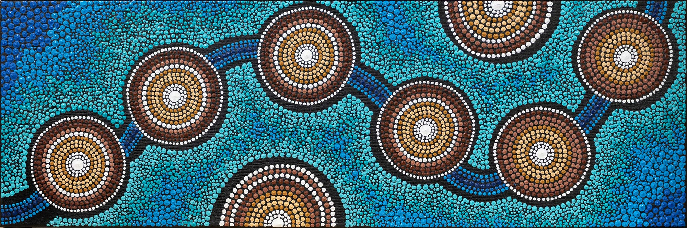

# Week-8-quiz
- Part 1
    - For part 1 inspiration, I want to choose Bec Morgan's art work "When the fresh water meets the saltwater" as my inspiration. I was inspired by the use of color and the combination of shapes in this abstract artwork. I plan to experiment with similar abstract forms in my projects to express an emotion or concept. This technique will help me to create a nice and impressive visual effect in line with the assignment.
    - 
    - 
- Part 2
    - I plan to use p5.js to draw circles and curves similar to those in Bec Morgan's art work. First set up a canvas, then use the draw function to draw circles and use a for loop to iterate through and draw the circles in the array. A function is needed to add new circles and for loop is used to limit the number and make sure they don't overlap. Lastly, a function and a for loop to stop the circles from growing if they are going to overlap each other.
    - 
    - Code Link: [circle packing](https://editor.p5js.org/KevinWorkman/sketches/5X6XxnAXuz)
